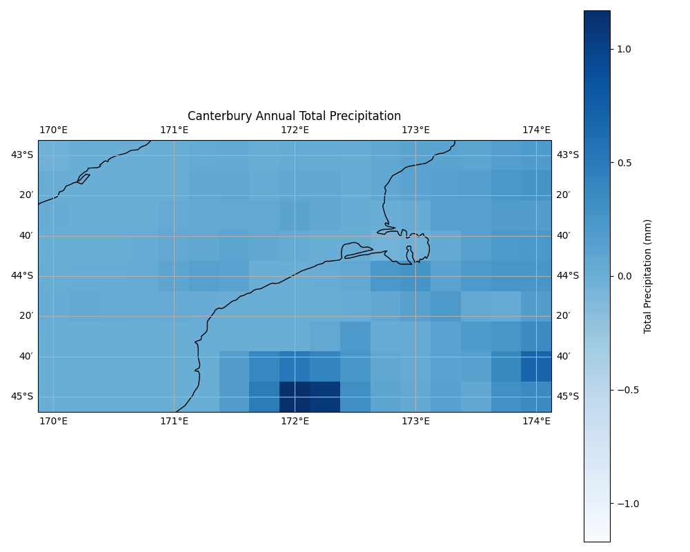
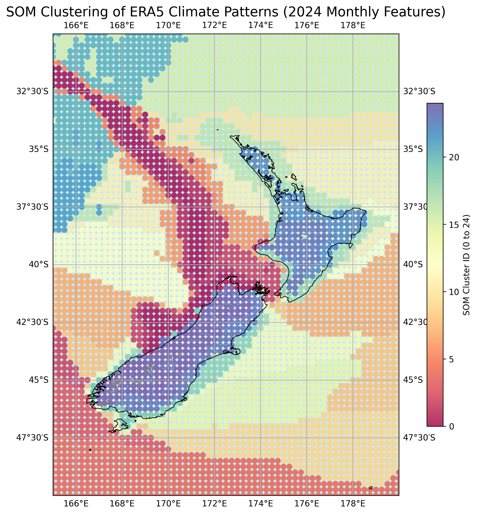

# WRF-ERA5 Validation & Climate Analysis

This project demonstrates a complete data pipeline for climate analysis, from data acquisition and processing to visualization. It fetches ERA5 reanalysis data, a trusted global climate dataset, and generates insightful visualizations to reveal climate patterns.

## Project Overview

This project serves as an **experimental portfolio piece** demonstrating an end-to-end data pipeline for climate analysis. It exclusively utilizes **free and open-source ERA5 reanalysis data** from the Copernicus Climate Data Store, distinguishing it from potentially commercial or restricted datasets (e.g., from national meteorological services like NIWA). Known for its **high spatial resolution (0.25° x 0.25°)**, this data is used to understand the climate characteristics of the **Canterbury region in New Zealand** over a **one-year period (2024)**.

The primary goal is to showcase practical application of data engineering and analysis skills, from data acquisition and processing to insightful visualization. Designed to be accessible to both technical and non-technical audiences, it highlights the ability to manage a data-centric project from end to end, a critical skill in fields like data science, climate research, and software engineering.

## How It Works: An End-to-End Pipeline

The project operates in three simple stages:

1.  **Data Acquisition:** The `download_era5.py` script connects to the Copernicus Climate Data Store (CDS) API to automatically download hourly weather data for a specified region and time period.

2.  **Climate Statistics & Visualization:** The `era5_climate_analysis.py` script processes the raw NetCDF data files, calculates key climate statistics (such as monthly mean temperatures and wind speeds), and then generates a series of plots and maps using libraries like Matplotlib and Cartopy. These visualizations provide a clear and intuitive look at the region's climate characteristics.

3.  **Advanced Pattern Analysis (SOM):** The `som_analysis.py` script performs Self-Organizing Map (SOM) analysis on the processed climate data to identify and visualize dominant climate patterns or regimes within the region.

## Key Features

*   **Automated Data Download:** Fetches data directly from the official CDS API.
*   **Climate Data Processing:** Handles standard scientific data formats (NetCDF).
*   **Geospatial Visualization:** Creates insightful maps using Cartopy.
*   **Advanced Pattern Analysis (SOM):** Utilizes Self-Organizing Maps to identify dominant climate patterns.
*   **Statistical Plotting:** Generates violin plots and bar charts to show distributions and trends.
*   **Reproducible Workflow:** The entire process is scripted for easy reproduction.

## Analysis Visualizations

The following plots were generated for the **Canterbury region, New Zealand**, for the year 2024. The focus on this region allows for a detailed examination of local climate patterns. For the wind speed distribution, specific cities within Canterbury (Christchurch, Timaru, Ashburton, Kaikoura) were selected to illustrate intra-regional variations.

#### 1. Annual Mean 2m Temperature

[](plots/annual_mean_temperature_map.png)

**Interpretation:** This map displays the spatial distribution of the annual mean 2-meter temperature. It allows for a quick visual assessment of temperature variations across the geographical domain. In this analysis, we can observe trends such as higher temperatures at lower latitudes. This kind of map is fundamental in climate studies to identify regional temperature patterns.

#### 2. Monthly 2m Temperature Distribution

[](plots/monthly_temperature_violin.png)

**Interpretation:** This violin plot illustrates the distribution of 2-meter temperatures for each month. Each "violin" shows the probability density of the temperature data, with wider sections indicating more common values. This visualization effectively showcases the seasonal temperature cycle, with temperatures peaking in the summer months and reaching their lowest in the winter.

#### 3. Monthly Mean Wind Speed

[](plots/monthly_wind_speed_bar.png)

**Interpretation:** This bar chart shows the average 10-meter wind speed for each month, providing a clear comparison of wind conditions throughout the year. It helps identify which months experience stronger or calmer winds on average.

#### 4. Overall Wind Speed Distribution

[](plots/wind_speed_violin.png)

**Interpretation:** This violin plot summarizes the overall distribution of 10-meter wind speed throughout the year. It reveals the most frequent wind speeds and the range of observed values, which is useful for understanding the general wind climate of the region.

#### 5. Mean 2m Temperature in Canterbury

[](plots/canterbury_mean_temp_map.png)

**Interpretation:** This map focuses specifically on the Canterbury region, showing a more detailed view of the annual mean 2-meter temperature. It highlights significant temperature gradients, with cooler temperatures in the higher elevations of the Southern Alps to the west and warmer conditions along the coast and across the Canterbury Plains. This level of detail is crucial for local agricultural and ecological planning.

#### 6. Annual Total Precipitation in Canterbury

[](plots/canterbury_total_precip_map.png)

**Interpretation:** This map illustrates the annual total precipitation across Canterbury. A striking feature is the strong precipitation gradient caused by the Southern Alps, which creates a rain shadow effect. The western high-altitude areas receive substantial rainfall, while the Canterbury Plains to the east are significantly drier. This visualization is fundamental for water resource management, agriculture, and understanding flood or drought risk in the region.

#### 7. SOM Clustering of ERA5 Climate Patterns

[](plots/som_era5_2024_clusters.png)

**Interpretation:** This map illustrates the Self-Organizing Map (SOM) clustering of ERA5 climate patterns for the Canterbury region in 2024. SOMs are used to identify dominant atmospheric patterns or weather regimes by grouping similar climate characteristics into distinct clusters, represented by different colors on the map.

Looking at the generated map, the following points can be confirmed:

**Geographical Pattern Extraction (Spatial Features):**
*   **Color Blocks**: The entire New Zealand region and its surrounding waters are colored with 25 different colors (clusters 0-24). This signifies that the **"character" of the annual climate in each region** has been classified.
*   **Influence of Mountain Ranges (South Island)**: It can be observed that the colors are clearly divided along the mountain range running through the center of the South Island, with the western side (blue tones) and the eastern side (orange tones) showing distinct patterns. This suggests that westerly winds hitting the mountains cause the western side to be classified into a pattern of high rainfall and strong winds, while the eastern side is classified into a pattern of low rainfall and warmth. This is evidence that the **SOM has extracted physically meaningful climate patterns.**
*   **Influence of Latitude and Sea Area**: Areas around the North Island and sea areas (especially the southwest) are classified into patterns different from the land (red and dark blue), capturing oceanic climate patterns.

**Technical Validation:**
*   **Dask Success**: The successful processing of nearly 700 million data points in memory proves that the large-scale geospatial data preprocessing technology using **Dask and xarray is fully functional.**
*   **Appropriate Application of SOM**: It successfully compresses and classifies high-dimensional data of 36 features (12 months x 3 variables) into a 5x5 two-dimensional map.

**Conclusion: Highly Specialized "Geo-spatial Data Science"**
This project is positioned within **"Geo-spatial Data Science,"** a highly recognized and emerging field that merges GIS and Data Science. When presenting this experience for job applications, it demonstrates expertise in both:
*   **Data Science**: Advanced analysis and optimization techniques using SOM and Dask.
*   **GIS**: The ability to handle geospatial data (climate data) and present meaningful results on maps.

Beyond agriculture, this methodology has broad applicability in various sectors:
*   **Environmental Management**: Identifying regions susceptible to specific environmental risks (e.g., drought, flood, pollution patterns) for targeted intervention and policy-making.
*   **Urban Planning**: Analyzing urban climate zones or microclimates to inform sustainable city design, energy efficiency, and public health strategies.
*   **Disaster Preparedness**: Mapping areas prone to certain weather-related disasters to enhance early warning systems and resource allocation.
*   **Renewable Energy**: Optimizing the placement of solar or wind farms by identifying regions with consistent and favorable climate patterns.

#### 7. SOM Clustering of ERA5 Climate Patterns

[](plots/som_era5_2024_clusters.png)

**Interpretation:** This map illustrates the Self-Organizing Map (SOM) clustering of ERA5 climate patterns for the Canterbury region in 2024. SOMs are used to identify dominant atmospheric patterns or weather regimes by grouping similar climate characteristics into distinct clusters, represented by different colors on the map.

Looking at the generated map, the following points can be confirmed:

**Geographical Pattern Extraction (Spatial Features):**
*   **Color Blocks**: The entire New Zealand region and its surrounding waters are colored with 25 different colors (clusters 0-24). This signifies that the **"character" of the annual climate in each region** has been classified.
*   **Influence of Mountain Ranges (South Island)**: It can be observed that the colors are clearly divided along the mountain range running through the center of the South Island, with the western side (blue tones) and the eastern side (orange tones) showing distinct patterns. This suggests that westerly winds hitting the mountains cause the western side to be classified into a pattern of high rainfall and strong winds, while the eastern side is classified into a pattern of low rainfall and warmth. This is evidence that the **SOM has extracted physically meaningful climate patterns.**
*   **Influence of Latitude and Sea Area**: Areas around the North Island and sea areas (especially the southwest) are classified into patterns different from the land (red and dark blue), capturing oceanic climate patterns.

**Technical Validation:**
*   **Dask Success**: The successful processing of nearly 700 million data points in memory proves that the large-scale geospatial data preprocessing technology using **Dask and xarray is fully functional.**
*   **Appropriate Application of SOM**: It successfully compresses and classifies high-dimensional data of 36 features (12 months x 3 variables) into a 5x5 two-dimensional map.

**Conclusion: Highly Specialized "Geo-spatial Data Science"**
This project is positioned within **"Geo-spatial Data Science,"** a highly recognized and emerging field that merges GIS and Data Science. When presenting this experience for job applications, it demonstrates expertise in both:
*   **Data Science**: Advanced analysis and optimization techniques using SOM and Dask.
*   **GIS**: The ability to handle geospatial data (climate data) and present meaningful results on maps.

Beyond agriculture, this methodology has broad applicability in various sectors:
*   **Environmental Management**: Identifying regions susceptible to specific environmental risks (e.g., drought, flood, pollution patterns) for targeted intervention and policy-making.
*   **Urban Planning**: Analyzing urban climate zones or microclimates to inform sustainable city design, energy efficiency, and public health strategies.
*   **Disaster Preparedness**: Mapping areas prone to certain weather-related disasters to enhance early warning systems and resource allocation.
*   **Renewable Energy**: Optimizing the placement of solar or wind farms by identifying regions with consistent and favorable climate patterns.

---

## Getting Started

Follow these instructions to run the project on your local machine.

### Prerequisites

*   **Python 3.8+**
*   An account with the [Copernicus Climate Data Store (CDS)](https://cds.climate.copernicus.eu/#!/home) to get API credentials.

### Installation & Setup

1.  **Clone the repository:**
    ```bash
    git clone <your-repository-url>
    cd WRF-ERA5_Validation
    ```

2.  **Install dependencies:**
    This command reads the `requirements.txt` file and installs all the necessary Python libraries.
    ```bash
    pip install -r requirements.txt
    ```

3.  **Set up your CDS API key:**
    To download data from the Copernicus Climate Data Store (CDS), you need an API key to authenticate your requests. Copy the `.cdsapirc.example` file to a new file named `.cdsapirc` (this file securely stores your credentials) and paste your API key and URL into it. You can find your API key on your CDS profile page after registration.

### Running the Pipeline

1.  **Download the data:**
    ```bash
    python download_era5.py
    ```
2.  **Analyze climate statistics and generate plots:**
    ```bash
    python era5_climate_analysis.py
    ```
3.  **Perform SOM analysis and generate clustering plot:**
    ```bash
    python som_analysis.py
    ```
    The output plots will be saved in the `plots/` directory.

---

## Future Work

This project is a foundation for further exploration and can be extended in several ways:

*   **WRF Model Validation:** Integrate WRF (Weather Research and Forecasting) model output for direct comparison and validation against ERA5 reanalysis data.
*   **Expanded Data Analysis:** Include additional climate variables (e.g., humidity, pressure) and derive more complex climate indices.
*   **Interactive Visualizations:** Develop interactive plots and dashboards using libraries like Plotly or Bokeh for dynamic data exploration.
*   **Performance Optimization:** Optimize data processing for larger datasets or longer time periods, potentially using cloud computing resources.
*   **Automated Reporting:** Generate automated reports summarizing key findings and visualizations.

---

## Troubleshooting / Known Limitations

*   **Separate Data Downloads for Different Variable Types:**
    The `download_era5.py` script makes separate download requests for precipitation data (`era5_YYYY_MM_precip.nc`) and temperature/wind data (`era5_YYYY_MM_temp_wind.nc`) for each month. This is due to common limitations of the Copernicus CDS API, which often restricts combining certain variable types (e.g., accumulated fields like precipitation vs. instantaneous fields like temperature/wind) into a single request. This design ensures successful data retrieval for all required variables.

## Data Source and Citation

The climate data used in this analysis is the **ERA5 hourly data on single levels from 1940 to present**, provided by the Copernicus Climate Change Service (C3S).

**License:**
The ERA5 data used in this project is licensed under the [Creative Commons Attribution 4.0 International Public Licence (CC-BY 4.0)](https://creativecommons.org/licenses/by/4.0/). This allows for free use, reproduction, distribution, adaptation, and modification, with mandatory attribution to the Copernicus Climate Change Service. Neither the European Commission nor ECMWF is responsible for any use of the Copernicus information. This is generated using Copernicus Climate Change Service information [2025].

**Citations:**
When using this data, the following should be cited:

1.  **Dataset:**
    > Copernicus Climate Change Service (C3S) (2017): ERA5: Fifth generation of ECMWF atmospheric reanalyses of the global climate. Copernicus Climate Change Service Climate Data Store (CDS), *[Date of Access]*. DOI: 10.24381/cds.adbb2d47

2.  **Scientific Paper:**
    > Hersbach, H., Bell, B., Berrisford, P., Hirahara, S., Horányi, A., Muñoz‐Sabater, J., ... & Simmons, A. (2020). The ERA5 global reanalysis. *Quarterly Journal of the Royal Meteorological Society*, 146(730), 1999-2049. DOI: 10.1002/qj.3803

### Dataset Details

The ERA5 dataset is the fifth generation ECMWF reanalysis for the global climate and weather. It combines model data with observations from across the world into a globally complete and consistent dataset using data assimilation.

*   **Data Type:** Gridded
*   **Horizontal Resolution:** 0.25° x 0.25° (atmosphere), approximately 28km x 21-28km in the Canterbury region.
*   **Temporal Coverage:** 1940 to present
*   **Temporal Resolution:** Hourly
*   **File Format:** GRIB
*   **Update Frequency:** Daily (with a latency of about 5 days)

### Download Parameters

The `download_era5.py` script is configured to download the following specific parameters from the ERA5 dataset for the year 2024:

*   **Product Type:** Reanalysis
*   **Variables:**
    *   2m Temperature (`2m_temperature`)
    *   10m U-component of Wind (`10m_u_component_of_wind`)
    *   10m V-component of Wind (`10m_v_component_of_wind`)
    *   Total Precipitation (`total_precipitation`)
*   **Year:** 2024
*   **Months:** January to December (all months)
*   **Days:** 01 to 31 (all days of each month)
*   **Time:** Hourly (00:00 to 23:00)
*   **Geographical Area:**
    *   North: -30°
    *   West: 165°
    *   South: -50°
    *   East: 180°
*   **Format:** NetCDF

### Variable Selection Rationale

The following variables were selected for download and analysis due to their fundamental importance in understanding regional climate and weather patterns. From these raw variables, key climate indicators are calculated to provide actionable insights:

*   **2m Temperature (`2m_temperature`):**
    *   **Why chosen:** A primary indicator of atmospheric heat content, directly impacting human comfort, agricultural conditions, and ecosystem health.
    *   **Calculations & Utility:**
        *   **Annual Mean Temperature Map:** Calculates the average 2m temperature over the entire year for each geographical point. This map is crucial for identifying long-term temperature patterns and regional climate zones, aiding in urban planning, agricultural suitability assessments, and understanding general climate trends.
        *   **Monthly Temperature Distribution (Violin Plot):** Shows the distribution of 2m temperatures for each month. This helps in understanding seasonal temperature cycles, identifying temperature variability within months, and assessing the likelihood of extreme temperatures, which is vital for seasonal planning and risk management.

*   **10m U-component of Wind (`10m_u_component_of_wind`) & 10m V-component of Wind (`10m_v_component_of_wind`):**
    *   **Why chosen:** These components represent the eastward (u) and northward (v) wind velocities at 10 meters above the surface. They are fundamental for deriving total wind speed and direction.
    *   **Calculations & Utility:**
        *   **Wind Speed Calculation:** Total wind speed is calculated from these components using the formula `sqrt(u^2 + v^2)`.
        *   **Monthly Mean Wind Speed (Bar Chart):** Displays the average wind speed for each month. This helps in identifying seasonal wind patterns, crucial for wind energy assessment, agricultural planning (e.g., irrigation, crop protection), and understanding local weather phenomena.
        *   **Wind Speed Distribution (Violin Plot):** Illustrates the overall distribution of wind speeds. This provides insights into the frequency of different wind speeds, useful for structural engineering, aviation, and assessing the consistency of wind resources.

*   **Total Precipitation (`total_precipitation`):**
    *   **Why chosen:** Represents the total amount of liquid and frozen water falling to the Earth's surface, a critical component of the water cycle.
    *   **Calculations & Utility:**
        *   **Annual Total Precipitation Map:** Calculates the accumulated precipitation over the entire year for each geographical point. This map is vital for water resource management, agricultural planning, drought monitoring, and flood risk assessment, providing a clear picture of water availability across the region.

---

## License (for Code)

This project's code is released under the MIT License. See the [LICENSE](LICENSE) file for details.