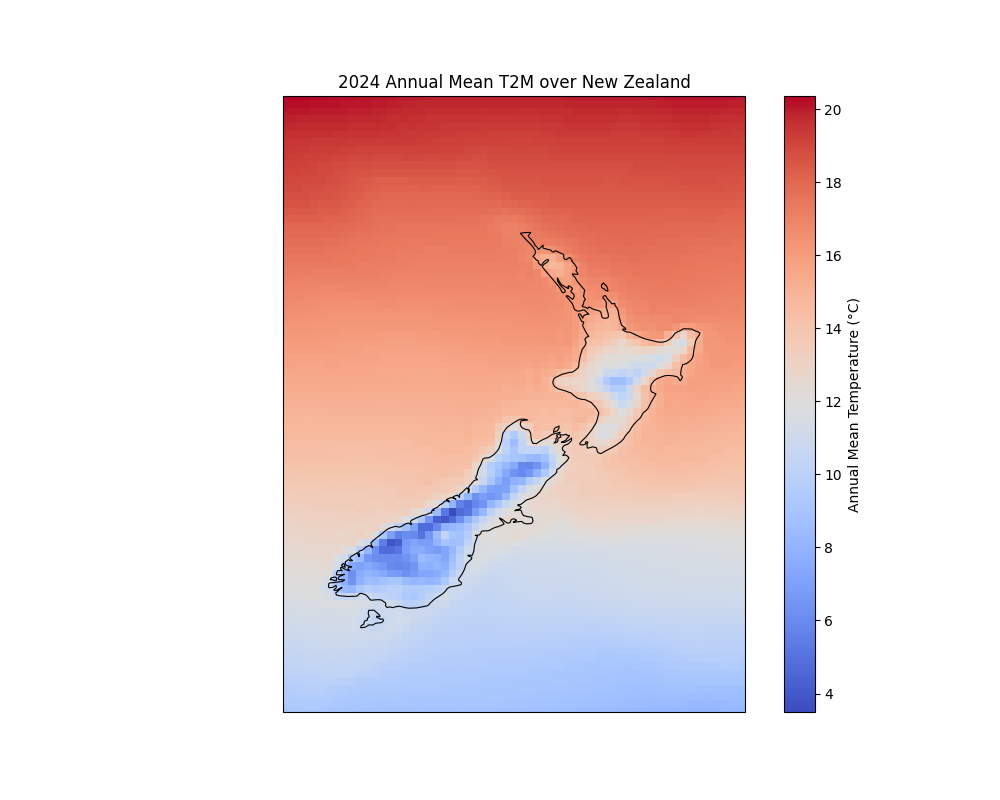
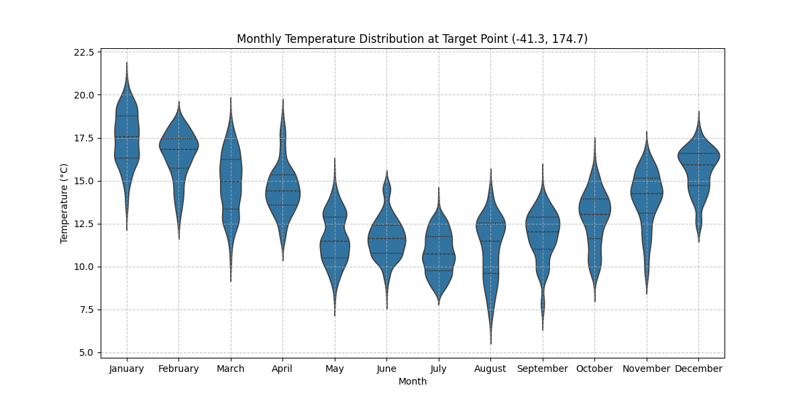
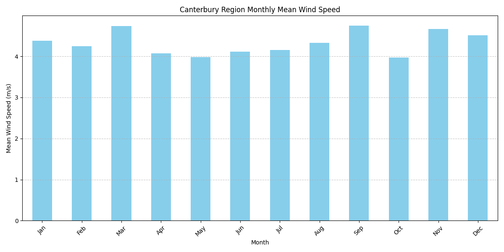
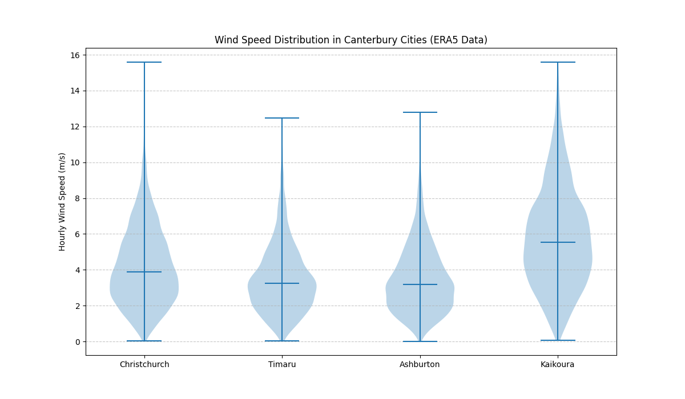

# WRF-ERA5 Validation & Climate Analysis

This project demonstrates a complete data pipeline for climate analysis, from data acquisition and processing to visualization. It fetches ERA5 reanalysis data, a trusted global climate dataset, and generates insightful visualizations to reveal climate patterns.

## Project Overview

This project serves as an **experimental portfolio piece** demonstrating an end-to-end data pipeline for climate analysis. It utilizes **free and open-source ERA5 reanalysis data**, known for its **high spatial resolution (0.25° x 0.25°)**, to understand local weather patterns over a **one-year period (2024)**.

The primary goal is to showcase practical application of data engineering and analysis skills, from data acquisition and processing to insightful visualization. Designed to be accessible to both technical and non-technical audiences, it highlights the ability to manage a data-centric project from end to end, a critical skill in fields like data science, climate research, and software engineering.

## How It Works: An End-to-End Pipeline

The project operates in three simple stages:

1.  **Data Acquisition:** The `download_era5.py` script connects to the Copernicus Climate Data Store (CDS) API to automatically download hourly weather data for a specified region and time period.

2.  **Analysis & Processing:** The `era5_analysis.py` script processes the raw NetCDF data files. It calculates key statistics, suchs as monthly mean temperatures and wind speeds, preparing the data for visualization.

3.  **Visualization:** The script then uses libraries like Matplotlib and Cartopy to generate a series of plots and maps. These visualizations provide a clear and intuitive look at the region's climate characteristics.

## Key Features

*   **Automated Data Download:** Fetches data directly from the official CDS API.
*   **Climate Data Processing:** Handles standard scientific data formats (NetCDF).
*   **Geospatial Visualization:** Creates insightful maps using Cartopy.
*   **Statistical Plotting:** Generates violin plots and bar charts to show distributions and trends.
*   **Reproducible Workflow:** The entire process is scripted for easy reproduction.

## Analysis Visualizations

The following plots were generated for the year 2024.

#### 1. Annual Mean 2m Temperature

[](plots/annual_mean_temperature_map.png)

**Interpretation:** This map displays the spatial distribution of the annual mean 2-meter temperature. It allows for a quick visual assessment of temperature variations across the geographical domain. In this analysis, we can observe trends such as higher temperatures at lower latitudes. This kind of map is fundamental in climate studies to identify regional temperature patterns.

#### 2. Monthly 2m Temperature Distribution

[](plots/monthly_temperature_violin.png)

**Interpretation:** This violin plot illustrates the distribution of 2-meter temperatures for each month. Each "violin" shows the probability density of the temperature data, with wider sections indicating more common values. This visualization effectively showcases the seasonal temperature cycle, with temperatures peaking in the summer months and reaching their lowest in the winter.

#### 3. Monthly Mean Wind Speed

[](plots/monthly_wind_speed_bar.png)

**Interpretation:** This bar chart shows the average 10-meter wind speed for each month, providing a clear comparison of wind conditions throughout the year. It helps identify which months experience stronger or calmer winds on average.

#### 4. Overall Wind Speed Distribution

[](plots/wind_speed_violin.png)

**Interpretation:** This violin plot summarizes the overall distribution of 10-meter wind speed throughout the year. It reveals the most frequent wind speeds and the range of observed values, which is useful for understanding the general wind climate of the region.

---

## Getting Started

Follow these instructions to run the project on your local machine.

### Prerequisites

*   **Python 3.8+**
*   An account with the [Copernicus Climate Data Store (CDS)](https://cds.climate.copernicus.eu/#!/home) to get API credentials.

### Installation & Setup

1.  **Clone the repository:**
    ```bash
    git clone <your-repository-url>
    cd WRF-ERA5_Validation
    ```

2.  **Install dependencies:**
    This command reads the `requirements.txt` file and installs all the necessary Python libraries.
    ```bash
    pip install -r requirements.txt
    ```

3.  **Set up your CDS API key:**
    To download data from the Copernicus Climate Data Store (CDS), you need an API key to authenticate your requests. Copy the `.cdsapirc.example` file to a new file named `.cdsapirc` (this file securely stores your credentials) and paste your API key and URL into it. You can find your API key on your CDS profile page after registration.

### Running the Pipeline

1.  **Download the data:**
    ```bash
    python download_era5.py
    ```
2.  **Analyze the data and generate plots:**
    ```bash
    python era5_analysis.py
    ```
    The output plots will be saved in the `plots/` directory.

---

## Troubleshooting / Known Limitations

*   **Separate Data Downloads for Different Variable Types:**
    The `download_era5.py` script makes separate download requests for precipitation data (`era5_YYYY_MM_precip.nc`) and temperature/wind data (`era5_YYYY_MM_temp_wind.nc`) for each month. This is due to common limitations of the Copernicus CDS API, which often restricts combining certain variable types (e.g., accumulated fields like precipitation vs. instantaneous fields like temperature/wind) into a single request. This design ensures successful data retrieval for all required variables.

## Data Source and Citation

The climate data used in this analysis is the **ERA5 hourly data on single levels from 1940 to present**, provided by the Copernicus Climate Change Service (C3S).

**License:**
The ERA5 data used in this project is licensed under the [Creative Commons Attribution 4.0 International Public Licence (CC-BY 4.0)](https://creativecommons.org/licenses/by/4.0/). This allows for free use, reproduction, distribution, adaptation, and modification, with mandatory attribution to the Copernicus Climate Change Service. Neither the European Commission nor ECMWF is responsible for any use of the Copernicus information. This is generated using Copernicus Climate Change Service information [2025].

**Citations:**
When using this data, the following should be cited:

1.  **Dataset:**
    > Copernicus Climate Change Service (C3S) (2017): ERA5: Fifth generation of ECMWF atmospheric reanalyses of the global climate. Copernicus Climate Change Service Climate Data Store (CDS), *[Date of Access]*. DOI: 10.24381/cds.adbb2d47

2.  **Scientific Paper:**
    > Hersbach, H., Bell, B., Berrisford, P., Hirahara, S., Horányi, A., Muñoz‐Sabater, J., ... & Simmons, A. (2020). The ERA5 global reanalysis. *Quarterly Journal of the Royal Meteorological Society*, 146(730), 1999-2049. DOI: 10.1002/qj.3803

### Dataset Details

The ERA5 dataset is the fifth generation ECMWF reanalysis for the global climate and weather. It combines model data with observations from across the world into a globally complete and consistent dataset using data assimilation.

*   **Data Type:** Gridded
*   **Horizontal Resolution:** 0.25° x 0.25° (atmosphere)
*   **Temporal Coverage:** 1940 to present
*   **Temporal Resolution:** Hourly
*   **File Format:** GRIB
*   **Update Frequency:** Daily (with a latency of about 5 days)

### Download Parameters

The `download_era5.py` script is configured to download the following specific parameters from the ERA5 dataset for the year 2024:

*   **Product Type:** Reanalysis
*   **Variables:**
    *   2m Temperature (`2m_temperature`)
    *   10m U-component of Wind (`10m_u_component_of_wind`)
    *   10m V-component of Wind (`10m_v_component_of_wind`)
    *   Total Precipitation (`total_precipitation`)
*   **Year:** 2024
*   **Months:** January to December (all months)
*   **Days:** 01 to 31 (all days of each month)
*   **Time:** Hourly (00:00 to 23:00)
*   **Geographical Area:**
    *   North: -30°
    *   West: 165°
    *   South: -50°
    *   East: 180°
*   **Format:** NetCDF
