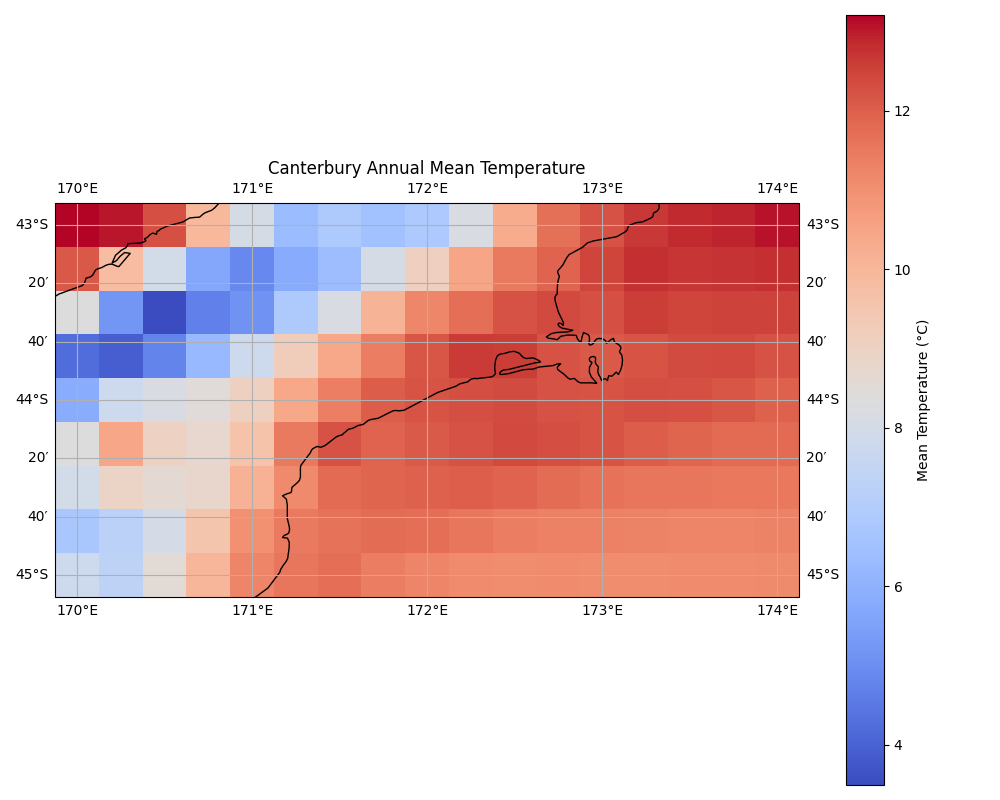

# WRF-ERA5 Validation & Climate Analysis

This project demonstrates a complete data pipeline for climate analysis,
from data acquisition and processing to visualization. It fetches ERA5
reanalysis data---a trusted global climate dataset---and generates
visualizations to reveal regional climate patterns.

## Project Overview

This **experimental portfolio project** showcases an end-to-end workflow
for climate data processing using **free and open-source ERA5 reanalysis
data** from the Copernicus Climate Data Store. It focuses on the
**Canterbury region, New Zealand**, analyzing data for the **year 2024**
at **0.25° x 0.25° spatial resolution**.

The goal is to demonstrate practical data engineering and visualization
skills, from acquisition and transformation to geospatial and
statistical analysis. The project is designed to be informative for both
technical and non-technical audiences.

------------------------------------------------------------------------

## Pipeline Overview

The project operates in three key stages:

1.  **Data Acquisition:**\
    The `download_era5.py` script connects to the CDS API to download
    hourly weather data for a specified region and period.

2.  **Climate Statistics & Visualization:**\
    The `era5_climate_analysis.py` script processes NetCDF files,
    computes key statistics (e.g., mean temperature, wind speed), and
    generates visualizations using Matplotlib and Cartopy.

3.  **Advanced Pattern Analysis (SOM):**\
    The `som_analysis.py` script applies Self-Organizing Map (SOM)
    analysis to detect dominant climate patterns or regimes.

------------------------------------------------------------------------

## Key Features

-   Automated data download from CDS API\
-   Processing of standard scientific formats (NetCDF)\
-   Geospatial visualization with Cartopy\
-   Advanced pattern detection using Self-Organizing Maps\
-   Violin and bar plots for climate statistics\
-   Fully reproducible scripted workflow

------------------------------------------------------------------------

## Analysis Visualizations

Visualizations for **Canterbury (2024)** include:

1.  **Annual Mean 2m Temperature**\
    \
    Highlights temperature gradients across the region.

2.  **Monthly Temperature Distribution (Violin Plot)**\
    \
    Shows seasonal cycles, with peaks in summer and lows in winter.

3.  **Monthly Mean Wind Speed (Bar Chart)**\
    \
    Compares average monthly wind conditions.

4.  **Overall Wind Speed Distribution (Violin Plot)**\
    \
    Summarizes wind speed variability throughout the year.

5.  **Canterbury Mean Temperature Map**\
    \
    Reveals coastal--mountain temperature contrasts.

6.  **Annual Total Precipitation Map**\
    \
    Demonstrates the rain shadow effect from the Southern Alps.

------------------------------------------------------------------------

## Getting Started

### Prerequisites

-   Python 3.8+\
-   Copernicus Climate Data Store account (for API credentials)

### Installation

``` bash
git clone <your-repository-url>
cd WRF-ERA5_Validation
pip install -r requirements.txt
```

### Configure API Access

Copy `.cdsapirc.example` to `.cdsapirc`, then insert your CDS API key
and URL (found on your CDS profile).

------------------------------------------------------------------------

## Running the Pipeline

1.  **Download data**

    ``` bash
    python download_era5.py
    ```

2.  **Analyze and visualize**

    ``` bash
    python era5_climate_analysis.py
    ```

3.  **Run SOM clustering**

    ``` bash
    python som_analysis.py
    ```

    Plots are saved in the `plots/` directory.

------------------------------------------------------------------------

## Future Work

-   Integrate WRF model outputs for validation against ERA5\
-   Extend analysis to additional variables (e.g., humidity, pressure)\
-   Add interactive dashboards (Plotly, Bokeh)\
-   Optimize for larger datasets or cloud workflows\
-   Automate report generation

------------------------------------------------------------------------

## Troubleshooting / Limitations

Due to CDS API constraints, `download_era5.py` performs separate monthly
downloads for: \* **Temperature & Wind data:**
`era5_YYYY_MM_temp_wind.nc` \* **Precipitation data:**
`era5_YYYY_MM_precip.nc`\
This ensures compatibility between instantaneous and accumulated fields.

------------------------------------------------------------------------

## Data Source and Citation

Data from **Copernicus Climate Change Service (C3S)**:\
\> ERA5 hourly data on single levels from 1940 to present\
\> DOI: [10.24381/cds.adbb2d47](https://doi.org/10.24381/cds.adbb2d47)

**Scientific Reference:**\
Hersbach, H. et al. (2020). *The ERA5 global reanalysis.* *Quarterly
Journal of the Royal Meteorological Society*, 146(730), 1999--2049. DOI:
[10.1002/qj.3803](https://doi.org/10.1002/qj.3803)

**License:**\
ERA5 data © Copernicus Climate Change Service, licensed under [CC-BY
4.0](https://creativecommons.org/licenses/by/4.0/).

------------------------------------------------------------------------

## Dataset Summary

-   **Type:** Gridded reanalysis data\
-   **Resolution:** 0.25° x 0.25° (\~28 km)\
-   **Temporal Coverage:** 1940--present (hourly)\
-   **Format:** NetCDF\
-   **Region:** 30°S--50°S, 165°E--180°E\
-   **Year:** 2024

### Variables Used

  -----------------------------------------------------------------------
  Variable           Description             Derived Metrics
  ------------------ ----------------------- ----------------------------
  2m Temperature     Atmospheric surface     Annual mean, monthly
                     temperature             distributions

  10m U/V Wind       Eastward/northward wind Mean wind speed, wind regime
  Components         velocity                patterns

  Total              Accumulated             Annual totals, spatial
  Precipitation      liquid/frozen water     patterns
  -----------------------------------------------------------------------

------------------------------------------------------------------------

## License (for Code)

All source code is released under the MIT License.\
See the [LICENSE](LICENSE) file for details.
